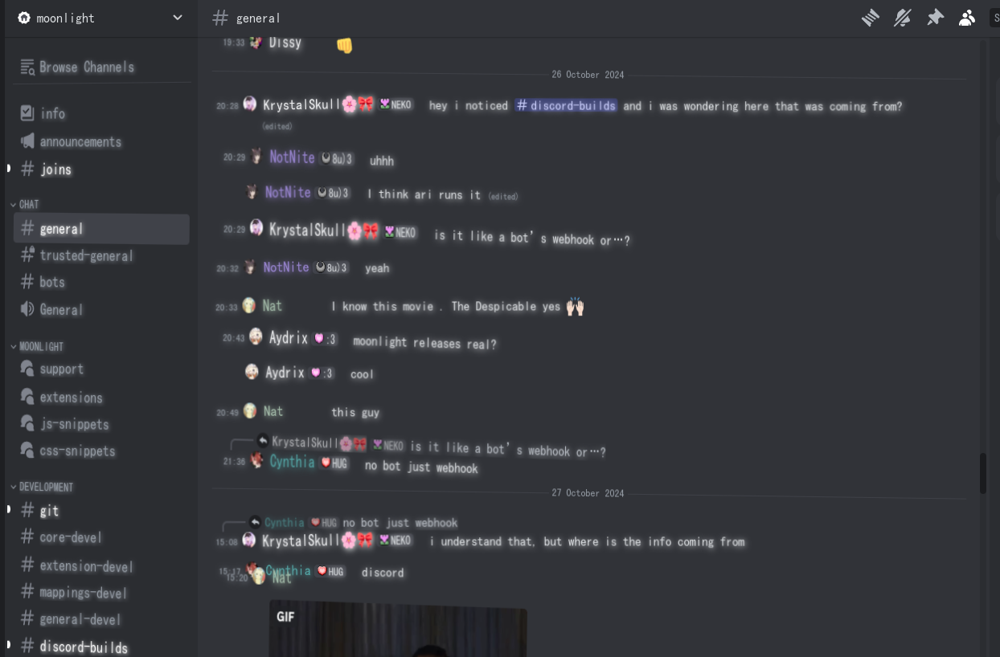
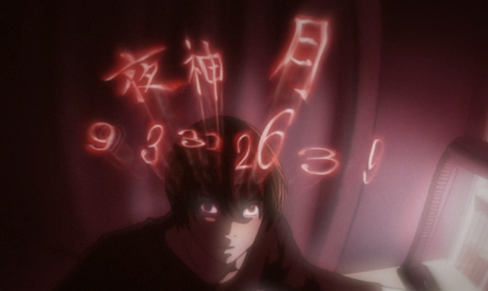

# purgatorycord
### a discord theme based on what you see when you die 

## info
this theme is developed on, and has only been tested on [moonlight](https://moonlight-mod.github.io/).
feel free to contribute or fork, hell if you're even more insane you could even daily drive this theme like i do!

### IMPORTANT NOTE: this theme requires that the "MS Gothic" font be installed on your computer.

like many amazing ideas, this entire theme was inspired by this one scene from death note

## goals
all updates and contributions to this theme should follow these goals
- messages should remain somewhat readable
- everything should only be implemented in css
- no external resources should be linked (local resources may be used in the future, but i'm still unsure)